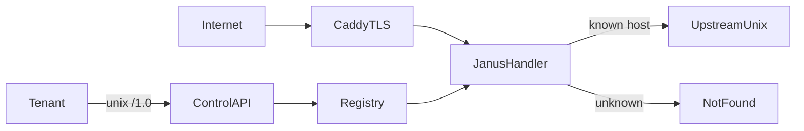

# Janus: tracked SPEC, core-first build

## Recommendation

**Yes — shift from design HTML to a living specification we track against.** The three design docs in [`docs/`](.) are the design conversation; they are not an acceptance contract. This document is the present-tense SPEC with phased milestones and checkable acceptance tests.

**Defer the Hub.** Bam is clear *because* it is a small, well-bounded protocol (~340 LOC Crystal ancestry). That is a reason to leave it alone until the chassis exists — not a reason to build it first.

| If we build Hub first | If we build core first |
| --- | --- |
| We rehost Bam inside Caddy with hard-coded backends | Every later feature plugs into a real registry |
| App ids, hosts, upstreams, heartbeats still undefined | Hub gets per-app namespaces, `bridge_path`, control-plane publish for free |
| Comfort work; low learning about Janus | Riskiest unknown (control plane + hot registry) proven early |

Bam is **protocol ancestry**, not a Crystal port. Hub in Janus is a Go reimplementation of `@` / `+` / `-` (and later `>` / `*`) on top of Janus routing. It needs host admission, per-app config, and a place to hang `POST …/hub/publish` — all core features.

Ping-only (`janus.go` + `Caddyfile.example`) already proved: module links, HTTPS on `:443`, cold Caddyfile admits into Janus. Do not expand Hub until data-plane traffic is real reverse_proxy.

## Spec artifact

This file is the tracked build SPEC:

[`docs/20260718-191425-janus-build-spec.md`](20260718-191425-janus-build-spec.md)

(Naming: `YYYYMMDD-HHMMSS-{filename}` under `docs/`.)

Contents of the contract:

1. **Boundaries** — cold Caddyfile vs hot `/1.0`; memory-only registry; unknown host → 404; no QuickJS
2. **Phased milestones** — each phase: goal, surface (endpoints/behaviors), acceptance commands/tests, explicit out-of-scope
3. **Glossary** — app id (`name-suffix`), expose, bridge_path, Hub vs Bam
4. **Non-goals for v1** — drain/events polish, mDNS, L4, Mercure, zero-Caddy `rip server`, edge OIDC

Keep the three HTML docs as design history; this SPEC is what we implement against. When a phase lands, tick its acceptance lines in the same commit as the code.

## Build order

### Phase 0 — SPEC + repo hygiene

- [x] Write this SPEC from the three HTML docs + decisions already locked
- [ ] Expand each phase below with full acceptance checkboxes as implementation nears
- [x] Document current ping-only baseline as Phase 1 “done”

### Phase 1 — Done: ping chassis

- [x] `http.handlers.janus` loads; `GET /ping` → `pong` over HTTPS
- Already proven locally

### Phase 2 — Control plane skeleton

- Second listener: **unix socket** only (not public :443)
- Incus-inspired envelope: `GET /1.0`, `GET /1.0/health`
- Sync responses; structured errors
- **Accept:** `curl --unix-socket …` against `/1.0` returns version/capabilities; process stays up with public ping still working

### Phase 3 — Apps registry (memory)

- `GET/POST /1.0/apps`, `GET/PUT/PATCH/DELETE /1.0/apps/{id}`
- Mint `name-xxxxxx` ids; ETag / If-Match on mutating writes
- Hosts first-wins; conflict → loud error
- **Accept:** register → list → get → delete; restart Janus → registry empty (tenant must re-register)

### Phase 4 — Data plane: host → upstream

- Replace ping-as-default with: known Host → `reverse_proxy` to app upstreams (unix); unknown → 404
- Keep `/ping` as Janus self-check or move to control plane only (default: control `/1.0/health`, public `/ping` optional)
- **Accept:** fake upstream on a unix socket; `POST` app with host + upstream; `curl -sk https://that-host/` hits upstream; unknown host 404

### Phase 5 — Heartbeat / health

- `POST /1.0/apps/{id}/heartbeat`
- Stale clock → upstream marked unhealthy → **502/503** (not silent route-to-dead)
- **Accept:** stop heartbeats → public requests fail unhealthy; heartbeat resumes → traffic recovers

### Phase 6 — TLS allowlist hook

- Wire On-Demand TLS / ask to registry hosts (`expose` / allow)
- Cold Caddyfile still owns listeners/ACME machinery; hot registry only answers “may we mint for this name?”
- **Accept:** allowed host obtains cert path; disallowed name denied

### Phase 7 — Hub (Bam protocol in Go)

- Per-app Hub: client WS path, bridge POSTs to tenant `bridge_path`, fan-out `@`/`+`/`-`
- Control `POST /1.0/apps/{id}/hub/publish` (+ optional public publish with secret later)
- **Accept:** protocol pins ported from Bam behavior; Rip (or a tiny test backend) receives open/text/close and can publish back

### Phase 8 — First real tenant (Rip Server)

- Rip registers over `/1.0`, heartbeats, serves private HTTP on unix
- Out of Janus-only scope until Phase 4–5 green; SPEC lists the client contract

## What we deliberately do *not* do next

- Do not fold Bam source first
- Do not expand ping into a fake product surface
- Do not solve zero-Caddy local `rip server` inside Janus Phase 2–6 (park under Rip/open questions)
- Do not add registry durability (memory + re-register is the v1 contract)

## Immediate next step

Expand Phase 2 acceptance detail in this file as needed, then implement **Phase 2** (control unix socket + `/1.0` meta/health) as the first code milestone after ping.

## Related design docs

- [20260718-125236-rip-caddy.html](20260718-125236-rip-caddy.html)
- [20260718-125236-rip-caddy-ownership.html](20260718-125236-rip-caddy-ownership.html)
- [20260718-182420-janus-api-1.0.html](20260718-182420-janus-api-1.0.html)
