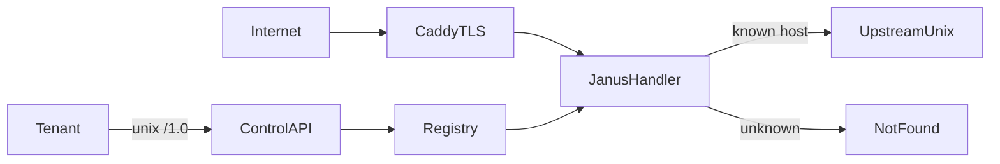

# Janus: tracked SPEC, core-first build

## Recommendation

**Yes — shift from design HTML to a living specification we track against.** The three design docs in [`docs/`](.) are the design conversation; they are not an acceptance contract. This document is the present-tense SPEC with phased milestones and checkable acceptance tests.

**Defer the Hub.** Bam is clear *because* it is a small, well-bounded protocol (~340 LOC Crystal ancestry). That is a reason to leave it alone until the chassis exists — not a reason to build it first.

| If we build Hub first | If we build core first |
| --- | --- |
| We rehost Bam inside Caddy with hard-coded backends | Every later feature plugs into a real registry |
| App ids, hosts, upstreams, heartbeats still undefined | Hub gets per-app namespaces, `bridge_path`, control-plane publish for free |
| Comfort work; low learning about Janus | Riskiest unknown (control plane + hot registry) proven early |

Bam is **protocol ancestry**, not a Crystal port. Hub in Janus is a Go reimplementation of `@` / `+` / `-` (and later `>` / `*`) on top of Janus routing. It needs host admission, per-app config, and a place to hang `POST …/hub/publish` — all core features.

Ping-only (`janus.go` + `Caddyfile`) already proved: module links, HTTPS on `:443`, cold Caddyfile admits into Janus. Do not expand Hub until data-plane traffic is real reverse_proxy.

## Spec artifact

This file is the tracked build SPEC:

[`docs/20260718-191425-janus-build-spec.md`](20260718-191425-janus-build-spec.md)

(Naming: `YYYYMMDD-HHMMSS-{filename}` under `docs/`.)

Contents of the contract:

1. **Boundaries** — cold Caddyfile vs hot `/1.0`; memory-only registry; unknown host → 404; no QuickJS
2. **Phased milestones** — each phase: goal, surface (endpoints/behaviors), acceptance commands/tests, explicit out-of-scope
3. **Glossary** — app id (`name-suffix`), expose, bridge_path, Hub vs Bam
4. **Non-goals for v1** — drain/events polish, mDNS, L4, Mercure, zero-Caddy `rip server`, edge OIDC

Keep the three HTML docs as design history; this SPEC is what we implement against. When a phase lands, tick its acceptance lines in the same commit as the code.

## Build order

Capabilities land in order. **ping** is primordial (needs nothing else). **control** is second. Everything after that builds on `/1.0`.

| # | Cold capability | Phase |
| --- | --- | --- |
| 1 | **ping** | Phase 1 |
| 2 | **control** | Phase 2 |
| 3+ | (none yet — Phase 3's apps registry is hot `/1.0` work, not a cold capability) | Phase 3+ |

### Phase 0 — SPEC + repo hygiene

- [x] Write this SPEC from the three HTML docs + decisions already locked
- [ ] Expand each phase below with full acceptance checkboxes as implementation nears
- [x] Document current ping-only baseline as Phase 1 “done”

### Phase 1 — Done: ping (primordial)

- [x] Cold capability **ping** (see [`20260718-204255-capability-ping.md`](20260718-204255-capability-ping.md))
- [x] `http.handlers.janus` loads; `GET /ping` → `pong` over HTTPS — no control plane required
- [x] Cascade proven on `*.ripdev.io` / `on` / `off` (`./test.sh` ping group)

### Phase 2 — Done: control

- [x] Cold capability **control** (see [`20260718-203749-capability-control.md`](20260718-203749-capability-control.md)): `internal` / `local` / `public`
- [x] Self-contained lines + `token:…` (env / file / quoted literal); no control lines → default `internal`
- [x] Global Caddyfile: `control internal` + `control local`; site `janus` admits data plane
- [x] Serve `GET /1.0` + `GET /1.0/health` on configured listeners (Bearer when token set)
- [x] **Accept:** `curl http://127.0.0.1:7600/1.0`, `curl --unix-socket run/janus.sock …`, public `/ping` still works (`./test.sh`)

### Phase 3 — Done: apps registry (memory)

- [x] `GET/POST /1.0/apps`, `GET/PUT/PATCH/DELETE /1.0/apps/{id}` on the existing control listeners (same Bearer behavior)
- [x] Mint `name-xxxxxx` ids (6 random `[a-z0-9]`); name/host validation rejects 400 loudly
- [x] `PUT …/upstreams` is an atomic full-list swap; the supervisor serializes its own writes (awaits each 200), so no fencing fields on the wire — no ETag / If-Match, no generation numbers (see [pool protocol](20260719-002000-pool-protocol.md)); a doorbell entry must be the only entry (else 400); empty list legal (= not routable)
- [x] Hosts first-wins; conflict → 409 naming the host and the holding app
- [x] **Accept:** register → list → get → delete; restart Janus → registry empty (tenant must re-register) — `./test.sh` apps group

### Phase 4 — Done: data plane: host → upstream

- [x] Replace ping-as-default with: known Host → `reverse_proxy` to app upstreams (unix); unknown → 404
- [x] Known host with **empty** `upstreams[]` → **503** + `Retry-After` (alive but not routable); never hold the request waiting on the tenant
- [x] **Doorbell ring:** upstream entries may be flagged `doorbell: true` → Janus does **not** forward the client's request; it sends its own `GET /ring` down the doorbell socket (client request waits, body unread), and on `204` (empty, advisory) re-reads the app's socket list from its own registry and proxies the original request to the fresh socks (first delivery, streaming); on `503` forwards the boot error; ring cap ~3; doorbell excluded from health accounting — see [pool protocol](20260719-002000-pool-protocol.md)
- [x] Keep `/ping` as Janus self-check: site-scoped ping answers first where enabled; every other path routes through the registry (control `/1.0/health` remains the control-plane check)
- [x] **Accept:** fake upstream on a unix socket; `POST` app with host + upstream; `curl -s https://that-host/` hits upstream; unknown host 404; `PUT upstreams []` → 503 with Retry-After; fake doorbell that swaps in a real upstream then answers the ring `204` → client's POST body arrives intact at the new upstream, exactly once, no visible redirect — `./test.sh` data group

### Phase 5 — Done: heartbeat / TTL reaping

- [x] `POST /1.0/apps/{id}/heartbeat` — empty body → 204; unknown id → 404; registration counts as the first heartbeat (a slow cold boot is never mistaken for dead)
- [x] Heartbeat = **supervisor** liveness, not worker readiness: empty `upstreams[]` with fresh heartbeats keeps the app registered (certs/hub/state intact); only a stale clock marks it dead
- [x] Stale clock (TTL 15s, heartbeat 5s; `JANUS_HEARTBEAT_TTL` shortens it for tests) → registration reaped by a background sweep (ticker at TTL/3), same effect as `DELETE`: entry removed, hosts freed → **404** — there is no softer "unhealthy but kept" state (see [pool protocol](20260719-002000-pool-protocol.md) "Heartbeat ≠ readiness"); per-app: one expiring app never touches another
- [x] **Accept:** stop heartbeats → past the TTL public requests 404 and the app is gone from `GET /1.0/apps`; recovery = the tenant re-registers (heartbeat → 404 → re-register + re-PUT upstreams) → traffic resumes; empty upstreams + live heartbeats → 503 but app stays registered — `./test.sh` heartbeat group

### Phase 6 — Done: TLS allowlist hook

- [x] Wire On-Demand TLS / ask to registry hosts (see [`20260719-141200-tls-ask.md`](20260719-141200-tls-ask.md)): `GET /1.0/tls/ask?domain=…` on the existing control listeners → 200 when the domain is a host claimed by a registered app, 404 when not, 400 when missing/empty
- [x] Cold Caddyfile still owns listeners/ACME machinery (`on_demand_tls { ask … }` global + per-site `tls { on_demand }`, stock grammar); hot registry only answers “may we mint for this name?”
- [x] Exact hosts only — normalized (lowercase, trailing dot stripped) exact-match against the host index; wildcards can never register (Phase 3 validation), so never allowed
- [x] Allowance is registry membership: register → allowed; DELETE or TTL reap → denied; alive-but-not-routable (`upstreams []` + fresh heartbeats) stays allowed — reload never breaks TLS
- [x] **Accept:** allowed host obtains cert path (registered `odt.janus.test` completes a real handshake on the `:8443` on-demand site — leaf minted by the internal CA with the exact SAN, chain verified against its root); disallowed name denied (handshake fails outright) — `./test.sh` tls group

### Phase 7 — Hub (Bam protocol in Go)

- Per-app Hub: client WS path, bridge POSTs to tenant `bridge_path`, fan-out `@`/`+`/`-`
- Control `POST /1.0/apps/{id}/hub/publish` (+ optional public publish with secret later)
- **Accept:** protocol pins ported from Bam behavior; Rip (or a tiny test backend) receives open/text/close and can publish back

### Phase 8 — First real tenant (Rip Server)

- Rip registers over `/1.0`, heartbeats, serves private HTTP on unix
- Client contract (reload, gen fencing, dirty-epoch loop): [20260719-002000-pool-protocol.md](20260719-002000-pool-protocol.md)
- Out of Janus-only scope until Phase 4–5 green

## What we deliberately do *not* do next

- Do not fold Bam source first
- Do not expand ping into a fake product surface
- Do not solve zero-Caddy local `rip server` inside Janus Phase 2–6 (park under Rip/open questions)
- Do not add registry durability (memory + re-register is the v1 contract)

## Cold config workflow

- **`Caddyfile`** (repo root) — working cold config while building; edit this as capabilities land.
- **Rich example** — add a polished `Caddyfile.example` (or similar) at the end for the public repo; do not maintain a parallel example during early phases.

## Capability cascade

Cold capabilities are either **process-wide** or **site-scoped**:

| Kind | Cascade | Example |
| --- | --- | --- |
| Process-wide | No — global `janus { }` only | **control** |
| Site-scoped | Yes — global default → site override | **ping** |

Rules for site-scoped settings:

1. Global `janus { … }` sets defaults for every site that uses `janus`
2. Site `janus { … }` overrides only keys it names
3. Unmentioned keys inherit
4. Explicit off beats inherited on (`ping off`)
5. Built-in default applies when unset at every level (`ping` → off)

Each capability doc states **Cascades: yes/no**.

## Immediate next step

Implement **Phase 7** — Hub (Bam protocol in Go): per-app WS fan-out on top of the proven routing chassis.

## Related design docs

- [20260718-125236-rip-caddy.html](20260718-125236-rip-caddy.html)
- [20260718-125236-rip-caddy-ownership.html](20260718-125236-rip-caddy-ownership.html)
- [20260718-182420-janus-api-1.0.html](20260718-182420-janus-api-1.0.html)
