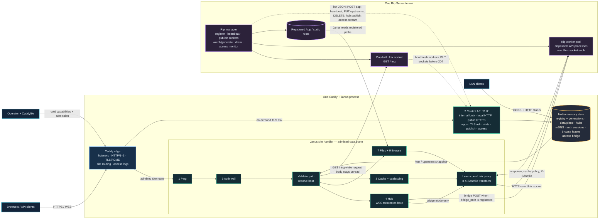

# Caddy + Janus + Rip Server — implementation map

This map separates the three owners in the running system:

- **Caddy** owns listeners, HTTP/1–3, TLS/ACME, site routing, the
  Caddyfile, and the access-log pipeline.
- **Janus** runs inside that Caddy process. Its process-wide `janus` app
  owns the hot `/1.0` API and shared memory; its
  `http.handlers.janus` site handler owns admitted request decisions.
- **Rip Server** is a tenant. Its manager registers the app and file
  policy, heartbeats, publishes Unix worker sockets, observes access
  events, and supervises disposable workers. Janus never starts or
  supervises Rip processes.

The companion rendered overview is
[`20260803-113427-janus-caddy-rip-architecture.svg`](20260803-113427-janus-caddy-rip-architecture.svg)
or
[`20260803-113427-janus-caddy-rip-architecture.png`](20260803-113427-janus-caddy-rip-architecture.png).

## Request path

For a normal admitted site, `Handler.ServeHTTP` answers enabled
`/ping` first, applies the auth wall, validates the request path, resolves
the host from the hot registry, and then chooses a terminal branch:

1. A WebSocket upgrade on the configured hub path terminates at Janus.
2. A registered static or browse root may answer directly.
3. An eligible anonymous `GET` may hit or fill the micro-cache.
4. Everything else proxies to a healthy least-connection Rip worker over
   a Unix socket. A final worker `X-Sendfile` response authorizes Janus to
   serve the file with its own validators, ranges, and streaming.

Unknown registry hosts answer `404`. An app with no usable upstream
answers `503`; Janus does not invent a tenant route from cold config.

## Rip control and reload path

The Rip manager sends an atomic `POST /1.0/apps` containing its name,
host or patterned site claim, optional registered-file policy, and
initial upstream list. It keeps that claim alive with a heartbeat every
5 seconds; Janus reaps a heartbeat lease after its configured TTL (15
seconds by default). Worker changes publish a complete replacement list
with `PUT /1.0/apps/{id}/upstreams`.

For a validated API change, Rip publishes its doorbell socket and drains
the old workers. The first demand makes Janus send a separate bodyless
`GET /ring` while leaving the client request body unread. Rip boots fresh
workers and awaits the upstream `PUT`; only then does the doorbell answer
`204`. Janus re-resolves the registry and delivers the original request
once to a fresh worker.

Hub WebSockets stay in Janus, above the disposable worker pool. A
registered `bridge_path` lets Janus POST socket lifecycle and frame events
to the worker data plane, and the worker response carries fan-out
directives. The Rip manager uses the trusted hub publish endpoint for
server-originated dings, but its current registration body does not emit
`bridge_path`; another hot API client may add it with `PATCH`.

## Lifetime boundary

Registry, data-plane, hub, mDNS, auth, browse, and access state use Caddy
usage pools, so overlapping Caddy config generations bind to the same
live state. A successful Caddy reload does not drop registrations or Hub
WebSockets. The registry is intentionally memory-only across process
restarts, so Rip Server re-registers.

## Code anchors

- Caddy module registration and cold grammar: [`caddyfile.go`](../caddyfile.go)
- Process-wide app and usage-pool lifecycle: [`app.go`](../app.go),
  [`state.go`](../state.go)
- Site request decision order: [`handler.go`](../handler.go)
- `/1.0` routes: [`control_api.go`](../control_api.go)
- Registration and heartbeat lifecycle: [`apps.go`](../apps.go)
- Unix proxy, health, least-connection routing, and sendfile hook:
  [`dataplane.go`](../dataplane.go)
- Doorbell implementation: [`ring.go`](../ring.go)
- Hub bridge and edge WebSocket termination: [`hub_bridge.go`](../hub_bridge.go),
  [`hub_ws.go`](../hub_ws.go)
- Rip manager implementation: `../rip/packages/server/manager.rip` in the
  sibling Rip repository
